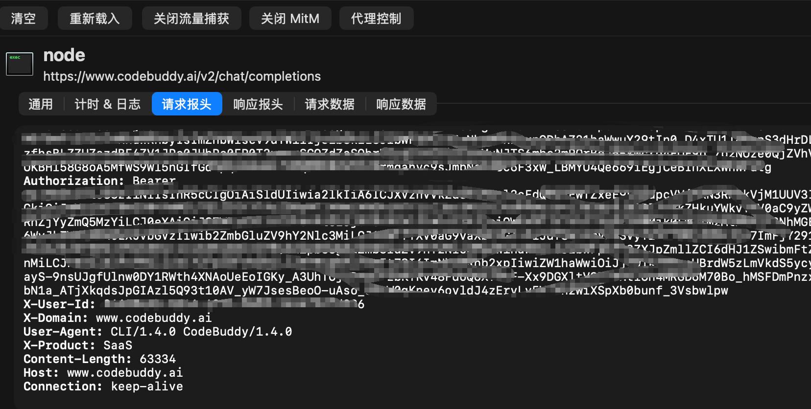

# codebuddy2cc - CodeBuddy2 Anthropic API Proxy

简单高效的Go API代理程序，将Anthropic Messages API格式请求转发到CodeBuddy上游服务。
CODEBUDDY2CC_KEY需要通过抓包软件获取Authorization的值。具体方法不在此赘述。

## 功能特点

- **格式转换**: Anthropic ↔ OpenAI兼容格式自动转换
- **认证管理**: Bearer token验证机制
- **流式支持**: 完整的Server-Sent Events流式响应
- **工具调用**: 支持function calling和tool使用
- **高性能**: 基于Gin框架，低延迟转发

## 快速开始

### 1. 配置环境

```bash
# 复制环境变量模板
cp .env.example .env

# 编辑.env文件，填入实际值
# CODEBUDDY2CC_AUTH=your_auth_token_here
# CODEBUDDY2CC_KEY=your_codebuddy_api_key_here
```

### 2. 构建和运行

```bash
# 构建
go build -o codebuddy2cc

# 运行
./codebuddy2cc
```

服务默认在端口8080启动。

### 3. 使用API

#### 非流式请求示例

```bash
curl -X POST http://localhost:8080/v1/messages \
  -H "Content-Type: application/json" \
  -H "Authorization: Bearer YOUR_AUTH_TOKEN" \
  -d '{
    "model": "claude-3-sonnet",
    "messages": [
      {"role": "user", "content": "Hello, how are you?"}
    ],
    "max_tokens": 100
  }'
```

#### 流式请求示例

```bash
curl -X POST http://localhost:8080/v1/messages \
  -H "Content-Type: application/json" \
  -H "Authorization: Bearer YOUR_AUTH_TOKEN" \
  -d '{
    "model": "claude-3-sonnet",
    "messages": [
      {"role": "user", "content": "Write a short story"}
    ],
    "max_tokens": 200,
    "stream": true
  }'
```

## API规范

### 端点

- `POST /v1/messages` - Anthropic Messages API兼容端点
- `GET /health` - 健康检查端点

### 认证

所有请求必须包含Authorization头：
```
Authorization: Bearer YOUR_AUTH_TOKEN
```

### 请求格式

支持完整的Anthropic Messages API格式：

```json
{
  "model": "claude-3-sonnet",
  "messages": [
    {
      "role": "user|assistant|system",
      "content": "string or array of content blocks"
    }
  ],
  "tools": [...],  // 可选
  "temperature": 0.7,  // 可选
  "max_tokens": 1000,  // 可选
  "stream": true  // 可选
}
```

## 环境变量

- `CODEBUDDY2CC_AUTH`: 客户端认证token (必需)
- `CODEBUDDY2CC_KEY`: 上游API密钥 (必需)
- `PORT`: 服务端口 (可选，默认8080)

## 开发

### 项目结构

```
.
├── main.go              # 主程序入口
├── middleware/
│   └── auth.go         # 认证中间件
├── handlers/
│   └── messages.go     # 消息处理器
├── utils/
│   └── converter.go    # 格式转换工具
├── .env.example        # 环境变量模板
└── test.sh            # 测试脚本
```

### 测试

```bash
# 运行测试脚本
./test.sh
```

## 设计原则

- **KISS**: 保持简单，专注核心功能
- **SRP**: 单一职责，模块化设计
- **高性能**: 最小延迟，高并发支持
- **可靠性**: 完善的错误处理和日志记录